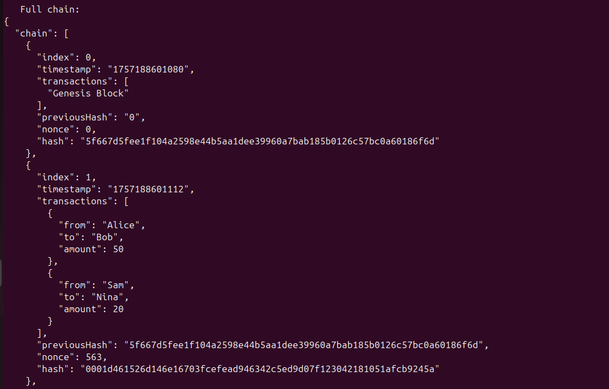
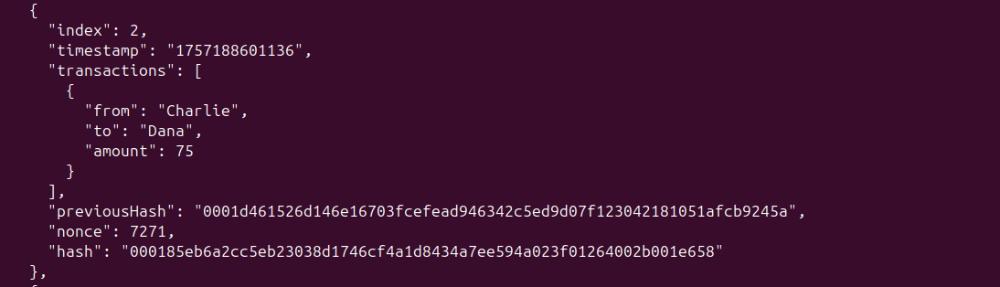

# Assignment 1 — Extended Mini Blockchain

## Overview
This project extends the mini blockchain built in Activity 1. It demonstrates:
- Proof-of-Work (mining) with difficulty ≥ 3,
- Multiple transactions per block,
- Blockchain validation and tamper detection,
- A short reflection on immutability and Proof-of-Work.

---

## 🚀 How to Run

1. Make sure Node.js is installed:
   ```bash
   node -v
   npm -v

## 🖥 Console Output

### Mining 3–4 Blocks


### Valid Chain Check




### Tampered Chain Check


## 📝 Reflection
A detailed reflection on immutability and Proof-of-Work is included here:  
[Reflection Document](Reflection/Reflection.docx)

